# 🌅 Blueprint Home Assistant - Luci Giardino Intelligenti (Migliorato)

Un blueprint avanzato e flessibile per Home Assistant che gestisce automaticamente l'illuminazione del giardino. Si basa sull'elevazione del sole, un sensore di movimento opzionale, orari programmabili e condizioni meteo.

## ✨ Caratteristiche Principali

- **Accensione al Tramonto**: Le luci si attivano automaticamente quando il sole scende sotto un'elevazione configurabile.
- **Sensore di Movimento Opzionale**: Aumenta la luminosità al rilevamento di un movimento. Il blueprint funziona perfettamente anche senza un sensore.
- **Boost per Maltempo**: Aumenta automaticamente la luminosità di base durante condizioni di maltempo (pioggia, nebbia, neve, nuvoloso).
- **Modalità Giorni Feriali**: Possibilità di eseguire l'automazione solo nei giorni lavorativi (da lunedì a venerdì).
- **Configurazione Flessibile**: Personalizza facilmente tutti i parametri, incluse luminosità, durate e orari, tramite l'interfaccia di Home Assistant.
- **Ottimizzazione Energetica**: Spegnimento notturno programmato e gestione intelligente della luminosità per ridurre i consumi.
- **Transizioni Morbide**: Effetti di transizione per accensione e spegnimento rendono i cambi di stato più gradevoli.
- **Logging Dettagliato**: Le azioni principali vengono registrate nel Logbook di Home Assistant per un facile monitoraggio e debug.

## 🏠 Requisiti

- Home Assistant `2023.4.0` o superiore.
- Integrazione `sun` (disponibile di default in Home Assistant).
- Almeno una luce dimmerabile (`light`).
- (Opzionale) Un sensore di movimento (`binary_sensor` con `device_class: motion`).
- (Opzionale) Un'entità `weather` (es. `weather.home`) per la funzione di boost meteo.

## 🚀 Installazione

### Metodo 1: Importa tramite URL
1.  Copia l'URL del file del blueprint nel tuo repository:
    ```
    https://github.com/matte1240/Smart-garden-lighting-1/blob/main/blueprints/garden_lights_automation.yaml
    ```
2.  In Home Assistant, vai su **Impostazioni > Automazioni & Scene > Blueprint**.
3.  Clicca su **Importa Blueprint** in basso a destra e incolla l'URL.

### Metodo 2: Download Manuale
1.  Scarica il file `garden_lights_automation.yaml` dalla cartella `blueprints` di questo repository.
2.  Copia il file nella tua cartella `config/blueprints/automation/` di Home Assistant.
3.  Ricarica le automazioni o riavvia Home Assistant.

## ⚙️ Configurazione

Crea una nuova automazione basata su questo blueprint e compila i seguenti campi:

| Parametro | Tipo | Default | Descrizione |
| :--- | :--- | :--- | :--- |
| **Luci giardino** | `target` | Richiesto | Le luci del giardino da controllare. |
| **Sensore movimento** | `entity` | Opzionale | Sensore per rilevare movimento. Lasciare vuoto se non usato. |
| **Elevazione sole** | `number` | -6 | Gradi sotto l'orizzonte per l'accensione. |
| **Luminosità base** | `number` | 30% | Intensità standard delle luci durante le ore serali. |
| **Luminosità movimento** | `number` | 80% | Intensità quando viene rilevato un movimento. |
| **Durata luminosità alta** | `duration` | 5 min | Per quanto tempo mantenere la luminosità alta dopo un movimento. |
| **Orario spegnimento** | `time` | 23:30 | Ora in cui le luci si spengono per la notte. |
| **Solo giorni feriali** | `boolean` | `false` | Se attivo, l'automazione funziona solo da lunedì a venerdì. |
| **Aumento per maltempo** | `boolean` | `false` | Se attivo, aumenta la luminosità base del 20% con il maltempo. |

## 📊 Logica di Funzionamento

L'automazione segue un flusso logico per decidere quando e come agire. Ogni volta che un evento la attiva (un *trigger*), valuta una serie di condizioni prima di eseguire l'azione corretta.

Il diagramma seguente illustra questo processo:

1.  **Controllo Iniziale**: Per prima cosa, verifica se l'automazione deve essere eseguita oggi (in base all'opzione "Solo giorni feriali").
2.  **Azione basata sul Trigger**: Se il controllo passa, sceglie l'azione appropriata in base a cosa l'ha attivata.
3.  **Modificatori Dinamici**: La *Luminosità Base* viene calcolata dinamicamente, tenendo conto del "Boost per Maltempo" se attivo.

```mermaid
graph TD
    subgraph "Step 1: Condizione Globale"
        A[▶️ Evento Trigger] --> B{È un giorno attivo?};
        B -- No --> Stop([❌ Stop Esecuzione]);
        B -- Sì --> C{Quale Trigger?};
    end

    subgraph "Step 2: Azioni Principali"
        C -- "🌅 Tramonto / 🌇 Mattino" --> D["💡 Accendi a <b>Luminosità Base</b>"];
        C -- "🚶 Movimento Rilevato" --> E["🔆 Aumenta a <b>Luminosità Movimento</b>"];
        C -- "⏱️ Fine Movimento" --> D;
        C -- "🌙 Orario Notturno" --> F["⚫ Spegni Luci"];
    end

    subgraph "Step 3: Calcolo Dinamico Luminosità"
        G(Luminosità Base) --> H{🌧️ Maltempo?};
        H -- Sì --> I[Base + 20%];
        H -- No --> J[Base Standard];
        I --> D;
        J --> D;
    end

    style Stop fill:#ffdddd,stroke:#c00,stroke-width:2px
    style F fill:#333,stroke:#fff,stroke-width:2px,color:#fff
```



## 🐛 Risoluzione Problemi

-   **Le luci non si accendono**: Controlla l'entità `sun.sun` e il suo attributo `elevation` negli Strumenti per sviluppatori. Assicurati che le luci siano online.
-   **Il sensore di movimento non attiva le luci**: Verifica che il sensore cambi stato correttamente. Controlla il Logbook per i messaggi di log del blueprint.
-   **L'automazione non parte**: Se hai attivato "Solo giorni feriali", assicurati che sia un giorno corretto. Controlla la traccia dell'automazione per vedere quale condizione ha fallito.

## 🤝 Contribuire

I contributi sono sempre i benvenuti!

1.  Forka il repository.
2.  Crea un nuovo branch (`git checkout -b feature/NuovaFunzione`).
3.  Committa le tue modifiche (`git commit -m 'Aggiunge NuovaFunzione'`).
4.  Fai il push al branch (`git push origin feature/NuovaFunzione`).
5.  Apri una Pull Request.

## 📝 Changelog

### v2.0.0
-   ✨ **FEATURE**: Il sensore di movimento è ora completamente opzionale.
-   ✨ **FEATURE**: Aggiunta opzione per eseguire l'automazione solo nei giorni feriali.
-   ✨ **FEATURE**: Aggiunto "Weather Boost" per aumentare la luminosità con il maltempo.
-   ✨ **FEATURE**: Aggiunto un trigger di controllo mattutino per riaccendere le luci se è ancora buio.
-   🔧 **IMPROVEMENT**: Logica delle variabili e delle condizioni resa più robusta.
-   🔧 **IMPROVEMENT**: Aggiunto logging su Logbook per le azioni principali.
-   🔧 **IMPROVEMENT**: Modalità dell'automazione impostata su `restart` per una gestione più sicura dei trigger.

### v1.0.0
-   🎉 Prima versione del blueprint.

## 📄 Licenza

Distribuito sotto licenza MIT. Vedi il file `LICENSE` per i dettagli.

## 🏷️ Tags

`home-assistant` `blueprint` `automation` `garden` `lights` `motion-sensor` `sunset` `smart-home` `domotica`